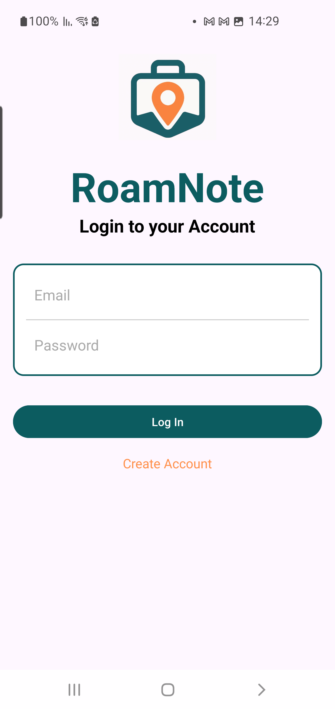
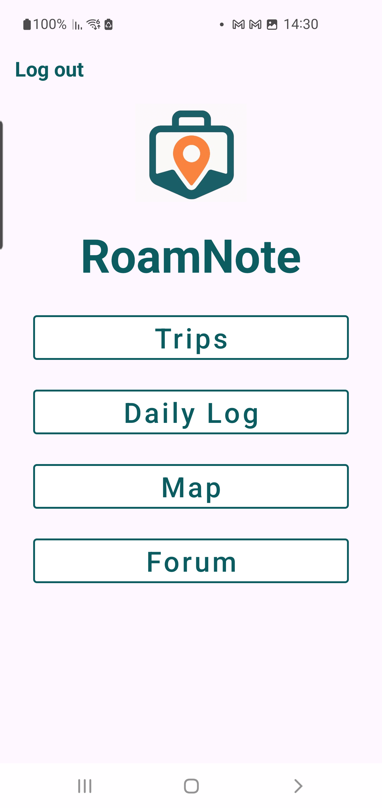
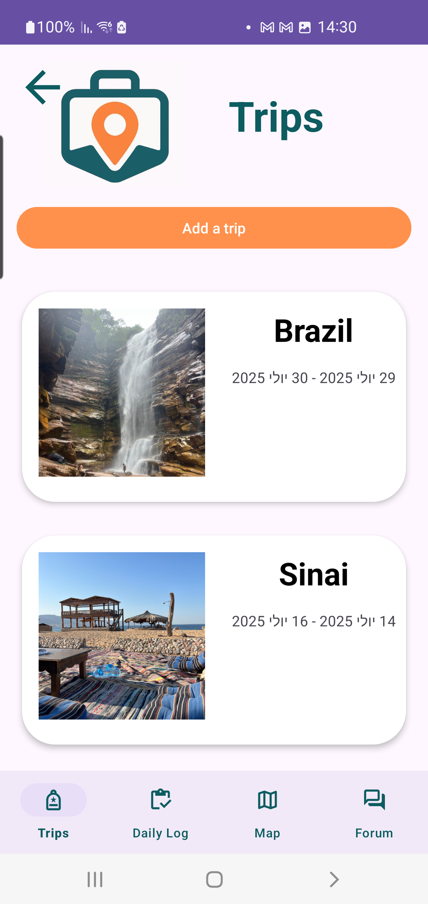
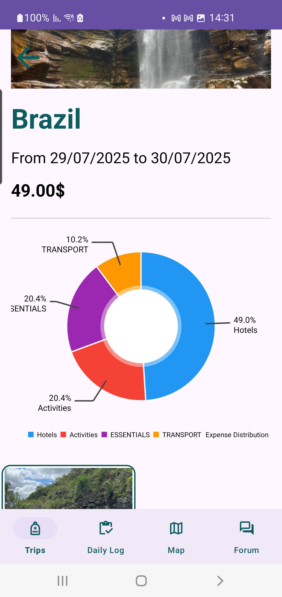
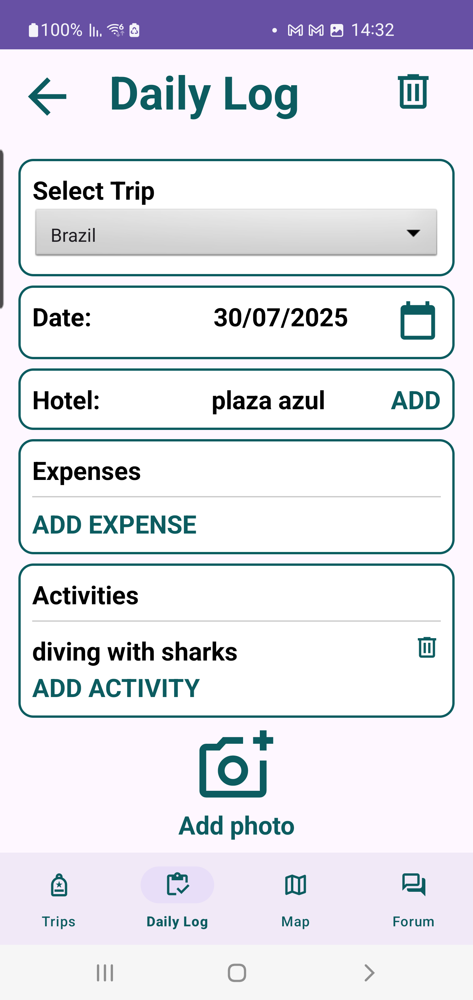
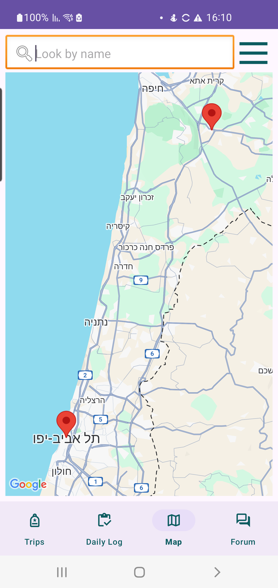
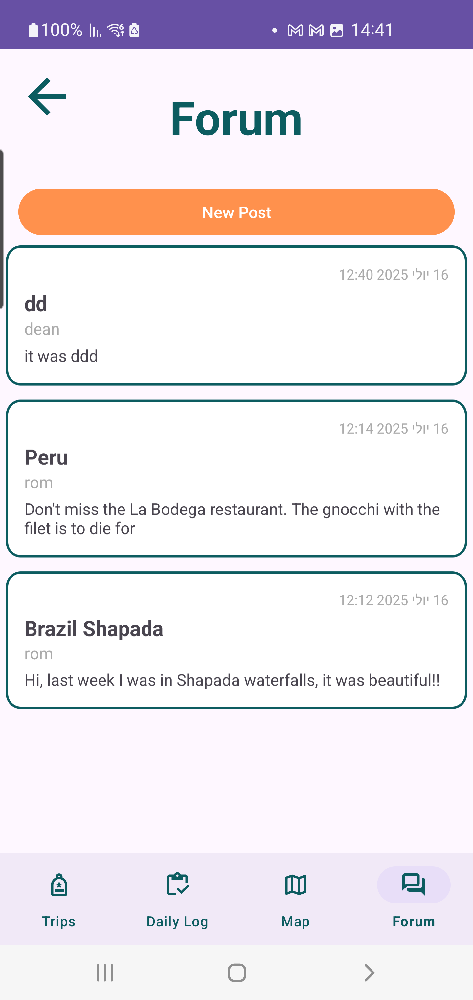

RoamNote 🌍

RoamNote is an Android app that helps travelers log trips, track expenses, add photos, and view all activities on an interactive map.
Built with Kotlin, Firebase, and Google Maps, it keeps your adventures organized and easy to revisit.

✨ Features
* Secure user login with Firebase

* Create trips with names, dates, and cover photos

* Add daily logs (hotels, expenses, activities, photos, locations)

* View trips on a dynamic map

* Track expenses with automatic trip totals

* Upload and display photos via Firebase Storage

* Community forum for sharing travel experiences

🛠 Tech Stack
* Kotlin (Android)

* Firebase Authentication, Realtime Database, Storage

* Google Maps API

* RecyclerView, Fragments, Navigation Components

🚀 Setup
1. Clone this repo and open in Android Studio.

2. Add your google-services.json (Firebase) to app/.

3. Enable Firebase Auth, Database, and Storage.

4. Add your MAPS_API_KEY to local.properties.

5. Sync Gradle and run.

📸 Screenshots

  

